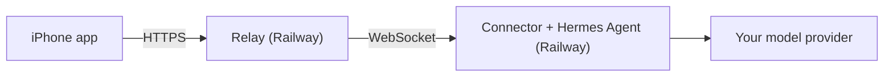

# Hermes iOS

> [!NOTE]
> An independent community project. Not affiliated with or endorsed by [Nous Research](https://nousresearch.com/) or the official [Hermes Agent](https://github.com/NousResearch/hermes-agent). Forked from [dylan-buck/Hermes-iOS](https://github.com/dylan-buck/Hermes-iOS).

A native iPhone app for your own [Hermes Agent](https://github.com/NousResearch/hermes-agent), hosted in the cloud. Chat with Hermes, hand work to a team of specialist agents, schedule automations, and manage what Hermes knows — all from your phone, with no computer left running at home.

## What you get

- **Chat** — streaming replies, attachments, voice mode, slash commands, and full chat history (switch, rename, delete, search).
- **Team** — a kanban team of Hermes profiles: a *chief of staff* you talk to, plus a **researcher**, **operator** (web tasks in a browser), **coder** and **reviewer** that pick up tasks in the background. See what's working, what's waiting on you, results and attachments; reply to unblock, approve or send back work, and edit each role's persona. Any chat message can be turned into a task for a role.
- **Automations** — scheduled jobs from Hermes's templates (morning briefing, news digest, price watch…) or your own prompt and schedule. Run now, pause, and read each run's output.
- **Library** — edit what Hermes remembers about you, and switch installed skills on or off.
- **Settings** — model, host status, and the last 7 days of cost, sessions and tokens.
- Phone context (location, health, motion) available to Hermes through MCP tools, if you allow it.

## How it works



- **Relay** (`relay/`): the only public service. Pairs your phone, stores chats, and forwards requests to your host.
- **Hermes host** (`deploy/railway/`): the official Hermes Agent image plus the connector (`connector/`). It runs your chats, the kanban team (via the Hermes gateway), cron jobs, and exposes an allowlisted slice of Hermes's API to the app. Nothing on it is publicly reachable.

## Set up your own

You need a [Railway](https://railway.com) account, an API key for a model provider (the defaults use [DeepSeek](https://platform.deepseek.com) `deepseek-flash`), and a way to sideload an IPA onto your iPhone (iOS 26+).

1. **Fork this repo** and create a Railway project with two services from it — `relay` and `hermes-host` — following [deploy/railway/README.md](deploy/railway/README.md). It lists every variable; you'll set your model key and time zone there.
2. **Get the app.** Build the unsigned IPA on a Mac with Xcode:
   ```bash
   scripts/build_unsigned_ipa.sh
   ```
   then sideload `HermesMobile-unsigned.ipa` with your usual tool.
3. **Pair your phone.** Create a pairing code on the host:
   ```bash
   railway ssh -s hermes-host -- hermes-mobile pair-phone
   ```
   In the app, choose *Enter Code Manually*, set the relay URL to `https://<your-relay-domain>/v1`, and enter the code.

That's it — open the Team tab to meet your agents.

### Customising

- **Roles:** each folder in `deploy/railway/roles/` becomes a Hermes profile (`SOUL.md` persona + `description`). Add a folder and redeploy to add a role, or edit personas from the app.
- **Model:** set `HERMES_PROVIDER`, `HERMES_MODEL` and `HERMES_BASE_URL` on `hermes-host`, plus that provider's API key.
- **Images:** DeepSeek is text-only. Set `GEMINI_API_KEY` on `hermes-host` and Gemini Flash reads attached images for it (override with `HERMES_VISION_MODEL`).
- **Voice mode** needs an OpenAI key: `railway ssh -s hermes-host -- hermes-mobile configure-realtime`.

## Limitations

- Sideloaded builds can't receive push notifications, so the app refreshes while it's open; widgets may not share data after re-signing.
- Everything Hermes reads — including phone data you share — is sent to your model provider.
- Running a self-hosted relay and connector on your own machine (the original setup) still works; see [connector/README.md](connector/README.md) and [relay/README.md](relay/README.md).

## Development

| Part | Tests |
|---|---|
| Connector (`connector/`) | `pip install -e 'connector[dev]' && pytest` |
| Relay (`relay/`) | `pip install -e 'relay[dev]' && pytest` |
| App | `xcodebuild -project HermesMobile.xcodeproj -scheme HermesMobile -destination 'platform=iOS Simulator,name=iPhone 17 Pro' test` |

- Add new Swift files with `scripts/xcode_add_files.py` (don't regenerate the project with XcodeGen; `project.yml` is out of date).
- The app runs against mock data with `UITEST_PAIRING_MODE=mock`; `ScreenshotTourUITests` captures every screen when `SCREENSHOT_DIR` is set.
- Design and implementation notes: [docs/superpowers/](docs/superpowers/).

## License

MIT — see [LICENSE](LICENSE).
